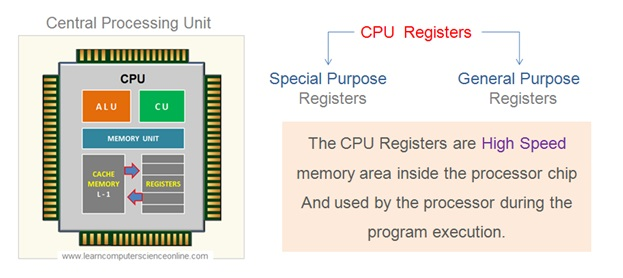
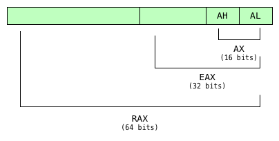

<p align="right"><a href="https://blog.dreadsec.me/">Return to Main Page</a></p>

<p align="center">
  
</p>
<h3 align="center">Introduction to x86/x64 Assembly: Part One, The Basics</h3>

<p align="left">
  Assembly is perhaps one of, if not the most, daunting languages one can learn in the realm of computer science and engineering. It’s like the deep end of the pool – that place where you tread cautiously, trying not to flounder in a sea of what seems like foreign instructions. It's raw, it's bare-bones, and it's fundamental to how a computer operates. So, in one form or another, it manages to worm its way into the lives of computer science and engineering students, typically in their first or second year.
<br><br>
  In this blog series, we're aiming to make the beast called assembly a bit more approachable. We'll attempt to untangle its complexities and delve deep into its core. This first installment will walk you through the foundational aspects of assembly language.
<br><br>
  So, whether you're a seasoned programmer looking to get back to the basics or a curious beginner raring to dive into the exhilarating world of low-level programming, this blog is for you. If the term 'assembly' incites a sense of foreboding, or if you merely want to understand what the fuss is all about, stick around.
</p>
  
<h3>Table of Contents</h3>

- Introduction to Assembly
  - Brief Overview of Assembly Language
  - The Importance of Learning Assembly
- Historical Context of Assembly Language
  - Brief History and Evolution
  - Role in Modern Computing
- Basics of Assembly Language
  - Structures Relevant to Assembly Language
  - Fundamental Components: Registers, Operands, and Instructions
- Getting Started with Assembly Language
  - Setting Up Your Environment
- Conclusion

<br>

# Introduction to Assembly
### Brief Overview of Assembly Language
<p align="left">
  Assembly language, also commonly referred to as simply 'assembly', is a low-level programming language that has a strong correspondence with the architecture's machine code instructions. Think of it as the bridge between high-level languages (like Python, Java, or C++) and the computer hardware itself. While programming in high-level languages involves writing more human-readable code, assembly deals directly with the computer's nuts and bolts.

  <p align="center">
    
  </p>
  
  The code written in assembly is processed by an assembler, which translates it into machine code—the lowest level of code that's directly executed by the computer's central processing unit (CPU). This means assembly gives you the power to write code that speaks directly to your computer's hardware.
<br><br>
  One of the key aspects of assembly language is that it is specific to a particular computer architecture, meaning the assembly language for one type of processor will differ from another. You'll often see terms like 'x86 assembly' or 'ARM assembly', referring to the specific hardware architectures.
<br><br>
  Now, you might be asking, "Why would I want to get my hands dirty with assembly when I could use Python or JavaScript?" That's a fair question. The answer lies in the level of control and optimization assembly provides. In certain situations—like systems programming, performance-critical applications, or when working with embedded systems—being able to control hardware at this granular level is a major advantage.
<br><br>
  For the sake of our collective sanity, we will be learning and making use of Intel’s syntax for x86 and x64 assembly in this series of blog posts. There are two major syntaxes for x86 and x64, Intel and AT&T, and, as you can tell from the previous remark, one is much better than the other.
<br><br>
  For example, just take a look at the difference between the two below.
</p>

<table align="center" style="margin: 0px auto;">
<tr>
<th>x86 (Intel)</th>
<th>x86 (AT&T)</th>
</tr>
<tr>
<td>

  
```asm

push eax     
mov eax, [ebx]
add eax, 5  
inc eax       
mov ebx, eax
pop eax      
add eax, ebx    

```

  
</td>
<td>

  
```asm

pushl %eax        
movl (%ebx), %eax   
addl $5, %eax   
incl %eax        
movl %eax, %ebx   
popl %eax      
addl %ebx, %eax  

```

  
</td>
</tr>
</table>

<p align="center">We will be using the syntax on the left throughout this series.</p>

### The Importance of Learning Assembly

<p align="left">
  You might be wondering why we should bother learning assembly language when we have powerful high-level languages at our disposal. Surely, it's easier to write a Python script or a C++ program, but there are several reasons why learning assembly is still highly beneficial, even in our modern computing landscape. For instance:
<br><br>
  1. <b>Understanding How Computers Truly Work</b>:
  Assembly language is a window into the heart of your computer. When you learn assembly, you get to understand the intricate mechanisms that allow your computer to function. You learn about registers, how data is managed in memory, how instructions are processed, and much more. It's like peeking under the hood of your car – you get to see the engine that drives the entire system.
<br><br>
  2. <b>Performance Optimization</b>:
  There are instances where the speed and efficiency of a program are absolutely critical, such as in game development, real-time systems, or high-frequency trading systems. With assembly, you have the ultimate control over your code, allowing you to squeeze out every ounce of performance from your hardware.
<br><br>
  3. <b>Debugging and Reverse Engineering</b>:
  Sometimes, to find an elusive bug or to understand a piece of malware, you'll need to dive into the assembly code of a program. Debuggers often show you the assembly instructions that correspond to your high-level code. By understanding assembly, you'll be better equipped to tackle these tasks.
<br><br>
  4. <b>Writing Drivers and Embedded Systems Programming</b>:
  Assembly language is often used to write drivers and for programming embedded systems, where hardware-specific code is necessary, and resources like memory and processing power are limited.
<br><br>
  5. <b>Broadens Your Skill Set</b>:
  Finally, having assembly language in your repertoire is an excellent way to stand out. It demonstrates your willingness to dive deep into complex topics and your understanding of computers at a fundamental level.
</p>

<br>

# Historical Context of Assembly Language
### Brief History and Evolution
<p align="left">
Assembly language has been around for quite a while, and understanding its origins can help us appreciate its role in shaping the modern computing world.
<br><br>
In the early days of computing, around the 1940s and 50s, programming was done using machine language – binary data directly understood by the hardware. This process was not only complex but also prone to errors. Introduced in the early 1950s, assembly was a breath of fresh air for programmers. It replaced the pain-in-the-ass raw binary with symbolic representations, making it easier for humans to write and understand. Each of these symbols, called mnemonics, represented a specific operation or instruction set on the machine.
<br><br>
The IBM 704, introduced in the mid-1950s, was one of the first computers to incorporate an assembly language, and it was quite revolutionary at the time. Soon, however, the process was automated with the development of the first assembler – a program that automates the translation of assembly language into machine language. This further simplified the task of writing low-level code and paved the way for the widespread use of assembly language.
<br><br>
As the years rolled by and computing technology evolved, assembly language became more sophisticated and powerful. Different types of assembly languages were developed for different hardware architectures, leading to the likes of x86, ARM, MIPS, and many more that we see today. Yet, despite the rise of high-level languages that offer greater simplicity and abstraction, assembly language remains relevant. It's commonly used in systems programming, embedded systems, reverse engineering, and anywhere else where hardware-level control and optimization are required.
</p>

### Role in Modern Computers
<p align="left">
  As mentioned in the previous section, despite the incredible progress in high-level languages, you might be surprised to find that assembly language still plays a significant role in modern computing. The world of programming is vast and varied, and there are many niches where assembly's unique capabilities make it the tool of choice.
<br><br>
  1. <b>Systems Programming</b>:
  Assembly language is often used in systems programming, which involves writing software that interfaces with, manages, and controls the computer's hardware or operating system. This includes writing operating systems, device drivers, and other hardware interfaces. In such scenarios, both the close hardware control and the optimization that assembly offers are invaluable.
<br><br>
  2. <b>Embedded Systems and Real-Time Systems</b>:
  Embedded systems, such as those found in cars, home appliances, or even spacecraft, often require the kind of precision control and optimization that only assembly can provide. The same goes for real-time systems, where the timeliness of responses is critical, and any delay can have severe consequences.
<br><br>
  3. <b>Reverse Engineering and Security</b>
  In cybersecurity, assembly is quite popular; experts often need to reverse engineer software to understand how it works, to find vulnerabilities, or to analyze malware. This often involves digging into the assembly code, making a knowledge of assembly language essential in this field.
<br><br>
  While assembly language is no longer the go-to language for general-purpose programming, it has found its niches where its unique capabilities make it not just relevant, but critical.
</p>
  
<br>
  
# Basics of Assembly Language
### Structures Relevant to Assembly Language
<p align="left">
  There is a reason computer science and engineering students are often introduced to assembly language following their introductory courses. The reason for this is that these courses taken prior to those related to assembly <b>must</b> introduce students to the data structures found in programming and beyond - notably assembly language. 
</p>
  
<h3 align="middle">The Stack</h3>
<p align="left">
  A stack in concept is a First-In-Last-Out (FILO) data structure but, in terms of assembly, it's a region of the computer's (or individual process') memory that stores temporary variables created by each function. It also helps keep track of nested function calls. The stack grows and shrinks automatically when your program runs, pushing data when needed and popping it when it's no longer required. The FILO order of the stack is crucial for managing function calls and returns.

<p align="center">
  
</p>

  As you can see above, in the context of a computer (x86) or process, the stack resides in memory and grows downward to lower memory addresses. Values may be <b>pushed</b> and <b>popped</b> off the stack throughout the lifetime of a program and it is crucial to be familiar with this simple data structure.
  
  * <b>Pushing to the stack</b>: pushing to the stack is the process of inserting a value at the top of the stack. As more values are pushed to the stack, previously pushed values sink below most recently pushed values. This is what causes the First-In-Last-Out element of a stack - the first element pushed to a stack will be the last one popped out, as it waits for any values pushed after it to be removed.
  * <b>Popping from the stack</b>: popping from the stack is the process of removing the value at the top of the stack.
  
  <br><br>
  You may have noticed additional structures in the graph above such as the heap, data segment, and code segment. Each of these has their own purpose.
  
  * <b>The Heap</b>: the heap is similar to the stack in the sense that it is a large area within memory where data is held, however, it differs in regard to its use and structure. The heap is used for storing dynamically allocated data - data that needs to be resized during runtime such as an array, for instance. The stack is highly structured where as the heap is less so, so this results in the stack not being able to have allocated data resized at runtime.
    * The stack can be thought of as a highly structured, contiguous stretch of memory where there are no holes between allocations; however, the heap can be thought of as a stretch of memory where there may be holes and allocations may resize themselves during runtime.
  * <b>The Data Segment</b>: the data (.data) segment is a read-write-execute section in memory where static and initialized data is stored that can be used throughout the process. It is important to note that the data segment is not part of the stack.
  * <b>The Code Segment</b>: the code (.text) segment is a read-execute section in memory where the code of the program is located.
</p>

<h3 align="middle">Registers</h3>
<p align="left">
  While the stack and heap are places data can be stored, they are not the only places - nor the fastest. Enter registers.
  
  <p align="center">
    
  </p>

  Registers, while much smaller than the stack and heap, are much faster. They are used to store and access data during program execution directly from the CPU which is much faster than doing so on either the heap or the stack - which reside in main memory. Registers are most often used for high-speed computations and storage of temporary data, such as a function return value or the result of some arithmetic operation. These registers can be directly accessed via assembly, where as accessing structures such as the stack or heap through assembly require indirection which we will cover next.
</p>

### Fundamental Components: Registers, Operands, and Instructions
<p align="left">
  We have already touched on the concept of registers, however, we have yet to explore how they are used in x86 and x64 assembly. We will start out with four of the most basic, general-purpose registers in both x86 and x64 assembly. While these registers have other specific purposes and use-cases that we will cover alter, for now, we are just interested in getting to know their names.
  
<table align="center" style="margin: 0px auto;">
<tr>
<th>x86</th>
<th>x64</th>
</tr>
<tr>
<td>

```asm
  eax ; the EAX register (x86, 32-bits)
  ebx ; the EBX register (x86, 32-bits)
  ecx ; the ECX register (x86, 32-bits)
  edx ; the EDX register (x86, 32-bits)
```

</td>
<td>

```asm
  rax ; the RAX register (x64, 64-bits)
  rbx ; the RBX register (x64, 64-bits)
  rcx ; the RCX register (x64, 64-bits)
  rdx ; the RDX register (x64, 64-bits)
```

</td>
</tr>
</table>

As you can see above, these are the name of the four most basic registers. It is important to note that, while RAX and EAX (and the other registers) are 64 and 32 bits respectively, it is possible to access specific segments of bits of either. For instance, if we wanted to access the lower 16 bits of EAX, we would make use of the AX register - which refers to the lower 16 bits of the 32 bit EAX register.


* For x64:
  * RAX is the full 64 bits.
  * EAX refers to the lower 32 bits of RAX.
  * AX refers to the lower 16 bits of EAX.
  * AH refers to the higher 8 bits of AX.
  * AL refers to the lower 8 bits of AX.
* For x86:
  * EAX is the full 32 bits.
  * AX refers to the lower 16 bits of EAX.
  * AH refers to the higher 8 bits of AX.
  * AL refers to the lower 8 bits of AX.


Any changes to the AX register, or any other register that refers to certain bits of the top-most register, will be reflected in those lower bits of the RAX register.

  <p align="center">
    
  </p>

This applies to RBX, RCX, and RDX as well.
</p>

<h3 align="middle">Operands and Instructions</h3>
<p align="left">
Instructions are the operations that the CPU performs. Each assembly language instruction corresponds to one (or sometimes more) machine language instruction that the CPU can execute directly.
<br><br>
There are many different types of instructions. Some perform basic arithmetic or logical operations (like ADD or AND). Others move data between registers and memory (like MOV or PUSH). Control flow instructions change the order in which instructions are executed (like JMP or CALL). Finally, system call instructions interact with the operating system to perform tasks like reading input or writing output (like INT on x86 architectures). In assembly language, each line of your program generally corresponds to one instruction. You specify the operation, followed by the operands that the operation should work on.
<br><br>
Instructions in x86 and x64 usually follow the syntax: `<instr> <ops>` where `ops` can be 1, 2, or 3 operands to instruction `instr`. For Intel syntax, the leftmost operand is the destination operand - the operand where the result of the instruction will be placed. While there are a lot of instructions in x86 and x64 assembly, we will take a quick look at the simplest of them all - `mov`, which has the syntax: `mov <dst>, <data>` where `dst` is a register or memory location, and `data` is some sort of data to move to `dst`.

  
<table align="center" style="margin: 0px auto;">
<tr>
<th>Simple Instructions (x64): <code>mov</code></th>
</tr>
<tr>
<td>

```asm
mov rax, rbx   ; move the value from the RBX register into the RAX register.
mov eax, 10h   ; move the hexadecimal value 10 into the EAX register.
mov rax, [rcx] ; treat the value in the RCX register as an address, fetch the value at address, move into RAX.
```

</td>
</tr>
</table>
  
  
As you can see above, not only have we been introduced to the `mov` instruction, but we have also been introduced to several things we can do with it. While we will dive much deeper into using instructions in Part Two, let us take a look at one more simple instruction: the `add` instruction. 
<br><br>
You would assume that the `add` instruction performs addition between two operands - and you would be right. The `add` instruction follows the syntax `add <lho> <rho>` where `lho` is the left-hand operand and `rho` is the right-hand operand. The `add` instruction will add the two operands together and store the result in the left-hand operand. So, for instance, see the table below.
  
<table align="center" style="margin: 0px auto;">
<tr>
<th>Simple Instructions (x64): <code>add</code></th>
</tr>
<tr>
<td>

```asm
add rax, rbx   ; add value in RBX to value in RAX, store result in RAX.
add eax, 10h   ; add hexadecimal value 10 to EAX, store the result in EAX.
add rax, [rcx] ; treat value in RCX as an address, fetch the value at address, add to the value in RAX, store
               ; the result back in RAX.
```

</td>
</tr>
</table>
  
Now that we are familiar with basic instructions, let us move forward to creating our first program. However, before we do so, we must first setup our environment to write in assembly. 
</p>

<br>
  
# Getting Started with Assembly Language
### Setting Up Your Environment
<p align="left">
Before we begin programming in assembly, we must first setup our environment to be able to assemble our written code. There are a couple options to choose from:
<br><br>
1. We can write assembly directly inline using C or C++,
2. or we can use a proper assembler such as NASM or GAS.
<br><br>
Writing assembly inline using C or C++ is the easiest option, however, this will not work for x64 assembly - only x86. On the other hand. using a proper assembler such as NASM or GAS will allow for both, and more! 
<br><br>
For assistance installing the NASM assembler, see <a href="https://www.tutorialspoint.com/assembly_programming/assembly_environment_setup.htm">here</a>. For GAS, see <a href="https://stackoverflow.com/questions/4252012/how-to-install-and-use-gas-gnu-compiler-on-linux">here</a>.
</p>
  
<br>
  
# Conclusion
<p align="left">
In this section, we have learned several things about assembly. We have learned its history, its role in modern computing, the sectors in which it is still crucial, and we have even dipped our toes in basic assembly syntax and instructions. As we move forward to Part Two, you should feel comfortable encountering additional instructions, as well as new concepts of the x86 and x64 assembly languages. Furthermore, we will explore the concepts of the stack base pointer and stack pointer - as well as the pointer arithmetic surrounding them.
<br><br>
Hopefully you have learned a good amount in this short write-up. See you in the next section.
</p>
  
<p align="center">brought to you by <a href="https://github.com/D7EAD">d7ead</a></p>
