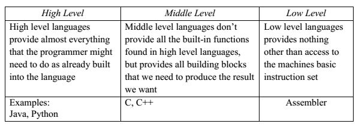
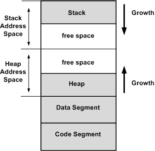

<p align="right"><a href="https://blog.dreadsec.me/">Return to Main Page</a></p>

<p align="center">
  
</p>
<h3 align="center">Introduction to x86/x64 Assembly: Part One, The Basics</h3>

<p align="left">
  Assembly is perhaps one of, if not the most, daunting languages one can learn in the realm of computer science and engineering. It’s like the deep end of the pool – that place where you tread cautiously, trying not to flounder in a sea of what seems like foreign instructions. It's raw, it's bare-bones, and it's fundamental to how a computer operates. So, in one form or another, it manages to worm its way into the lives of computer science and engineering students, typically in their first or second year.

  In this blog series, we're aiming to make the beast called assembly a bit more approachable. We'll attempt to untangle its complexities and delve deep into its core. This first installment will walk you through the foundational aspects of assembly language.

  So, whether you're a seasoned programmer looking to get back to the basics or a curious beginner raring to dive into the exhilarating world of low-level programming, this blog is for you. If the term 'assembly' incites a sense of foreboding, or if you merely want to understand what the fuss is all about, stick around.
</p>
  
<h3>Table of Contents</h3>

- Introduction to Assembly
  - Brief Overview of Assembly Language
  - The Importance of Learning Assembly
- Historical Context of Assembly Language
  - Brief History and Evolution
  - Role in Modern Computing
- Basics of Assembly Language
  - Structures Relevant to Assembly Language
  - Fundamental Components: Registers, Operands, and Instructions
- Getting Started with Assembly Language
  - Setting up Your Environment
- Concluding Remarks and What to Expect in Part Two
- Resources for Further Learning

<br>

# Introduction to Assembly
### Brief Overview of Assembly Language
<p align="left">
  Assembly language, also commonly referred to as simply 'assembly', is a low-level programming language that has a strong correspondence with the architecture's machine code instructions. Think of it as the bridge between high-level languages (like Python, Java, or C++) and the computer hardware itself. While programming in high-level languages involves writing more human-readable code, assembly deals directly with the computer's nuts and bolts.

  <p align="center">
    
  </p>
  
  The code written in assembly is processed by an assembler, which translates it into machine code—the lowest level of code that's directly executed by the computer's central processing unit (CPU). This means assembly gives you the power to write code that speaks directly to your computer's hardware.

  One of the key aspects of assembly language is that it is specific to a particular computer architecture, meaning the assembly language for one type of processor will differ from another. You'll often see terms like 'x86 assembly' or 'ARM assembly', referring to the specific hardware architectures.

  Now, you might be asking, "Why would I want to get my hands dirty with assembly when I could use Python or JavaScript?" That's a fair question. The answer lies in the level of control and optimization assembly provides. In certain situations—like systems programming, performance-critical applications, or when working with embedded systems—being able to control hardware at this granular level is a major advantage.

  For the sake of our collective sanity, we will be learning and making use of Intel’s syntax for x86 and x64 assembly in this series of blog posts. There are two major syntaxes for x86 and x64, Intel and AT&T, and, as you can tell from the previous remark, one is much better than the other.
  
  For example, just take a look at the difference between the two below.
</p>

<table align="center" style="margin: 0px auto;">
<tr>
<th>x86 (Intel)</th>
<th>x86 (AT&T)</th>
</tr>
<tr>
<td>

```asm
push eax     
mov eax, [ebx]
add eax, 5  
inc eax       
mov ebx, eax
pop eax      
add eax, ebx    
```

</td>
<td>

```asm
pushl %eax        
movl (%ebx), %eax   
addl $5, %eax   
incl %eax        
movl %eax, %ebx   
popl %eax      
addl %ebx, %eax  
```

</td>
</tr>
</table>

<p align="center">We will be using the syntax on the left throughout this series.</p>

### The Importance of Learning Assembly

<p align="left">
  You might be wondering why we should bother learning assembly language when we have powerful high-level languages at our disposal. Surely, it's easier to write a Python script or a C++ program, but there are several reasons why learning assembly is still highly beneficial, even in our modern computing landscape. For instance:

  1. <b>Understanding How Computers Truly Work</b>:
  Assembly language is a window into the heart of your computer. When you learn assembly, you get to understand the intricate mechanisms that allow your computer to function. You learn about registers, how data is managed in memory, how instructions are processed, and much more. It's like peeking under the hood of your car – you get to see the engine that drives the entire system.

  2. <b>Performance Optimization</b>:
  There are instances where the speed and efficiency of a program are absolutely critical, such as in game development, real-time systems, or high-frequency trading systems. With assembly, you have the ultimate control over your code, allowing you to squeeze out every ounce of performance from your hardware.

  3. <b>Debugging and Reverse Engineering</b>:
  Sometimes, to find an elusive bug or to understand a piece of malware, you'll need to dive into the assembly code of a program. Debuggers often show you the assembly instructions that correspond to your high-level code. By understanding assembly, you'll be better equipped to tackle these tasks.

  4. <b>Writing Drivers and Embedded Systems Programming</b>:
  Assembly language is often used to write drivers and for programming embedded systems, where hardware-specific code is necessary, and resources like memory and processing power are limited.

  5. <b>Broadens Your Skill Set</b>:
  Finally, having assembly language in your repertoire is an excellent way to stand out. It demonstrates your willingness to dive deep into complex topics and your understanding of computers at a fundamental level.
</p>

<br>

# Historical Context of Assembly Language
### Brief History and Evolution
<p align="left">
Assembly language has been around for quite a while, and understanding its origins can help us appreciate its role in shaping the modern computing world.

In the early days of computing, around the 1940s and 50s, programming was done using machine language – binary data directly understood by the hardware. This process was not only complex but also prone to errors. Introduced in the early 1950s, assembly was a breath of fresh air for programmers. It replaced the pain-in-the-ass raw binary with symbolic representations, making it easier for humans to write and understand. Each of these symbols, called mnemonics, represented a specific operation or instruction set on the machine.

The IBM 704, introduced in the mid-1950s, was one of the first computers to incorporate an assembly language, and it was quite revolutionary at the time. Soon, however, the process was automated with the development of the first assembler – a program that automates the translation of assembly language into machine language. This further simplified the task of writing low-level code and paved the way for the widespread use of assembly language.

As the years rolled by and computing technology evolved, assembly language became more sophisticated and powerful. Different types of assembly languages were developed for different hardware architectures, leading to the likes of x86, ARM, MIPS, and many more that we see today. Yet, despite the rise of high-level languages that offer greater simplicity and abstraction, assembly language remains relevant. It's commonly used in systems programming, embedded systems, reverse engineering, and anywhere else where hardware-level control and optimization are required.
</p>

### Role in Modern Computers
<p align="left">
  As mentioned in the previous section, despite the incredible progress in high-level languages, you might be surprised to find that assembly language still plays a significant role in modern computing. The world of programming is vast and varied, and there are many niches where assembly's unique capabilities make it the tool of choice.

  1. <b>Systems Programming</b>:
  Assembly language is often used in systems programming, which involves writing software that interfaces with, manages, and controls the computer's hardware or operating system. This includes writing operating systems, device drivers, and other hardware interfaces. In such scenarios, both the close hardware control and the optimization that assembly offers are invaluable.

  2. <b>Embedded Systems and Real-Time Systems</b>:
  Embedded systems, such as those found in cars, home appliances, or even spacecraft, often require the kind of precision control and optimization that only assembly can provide. The same goes for real-time systems, where the timeliness of responses is critical, and any delay can have severe consequences.

  3. <b>Reverse Engineering and Security</b>
  In cybersecurity, assembly is quite popular; experts often need to reverse engineer software to understand how it works, to find vulnerabilities, or to analyze malware. This often involves digging into the assembly code, making a knowledge of assembly language essential in this field.
  
  While assembly language is no longer the go-to language for general-purpose programming, it has found its niches where its unique capabilities make it not just relevant, but critical.
</p>
  
<b>
  
# Basics of Assembly Language
### Structures Relevant to Assembly Language
<p align="left">
  There is a reason computer science and engineering students are often introduced to assembly language following their introductory courses. The reason for this is that these courses taken prior to those related to assembly <b>must</b> introduce students to the data structures found in programming and beyond - notably assembly language. 
</p>
  
<h3 align="middle">The Stack</h3>
<p align="left">
  A stack in concept is a First-In-Last-Out (FILO) data structure but, in terms of assembly, it's a special region of the computer's (or individual process') memory that stores temporary variables created by each function. It also helps keep track of nested function calls. The stack grows and shrinks automatically when your program runs, pushing data when needed and popping it when it's no longer required. The FILO order of the stack is crucial for managing function calls and returns.

<p align="center">
  
</p>

  As you can see above, in the context of a computer (x86) or process, the stack resides in memory and grows downward to lower memory addresses. Values may be <b>pushed</b> and <b>popped</b> off the stack throughout the lifetime of a program and it is crucial to be familiar with this simple data structure.
  * <b>Pushing to the stack</b>: pushing to the stack is the process of inserting a value at the top of the stack. As more values are pushed to the stack, previously pushed values sink below most recently pushed values. This is what causes the First-In-Last-Out element of a stack - the first element pushed to a stack will be the last one popped out, as it waits for any values pushed after it to be removed.
  * <b>Popping from the stack</b>: popping from the stack is the process of removing the value at the top of the stack.
</p>
  
<p align="center">brought to you by <a href="https://github.com/D7EAD">d7ead</a></p>
